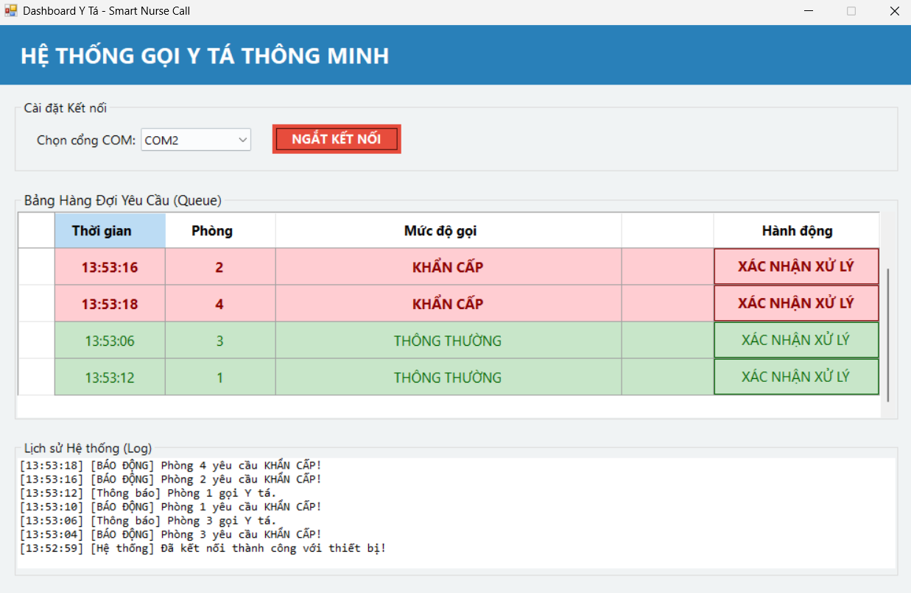
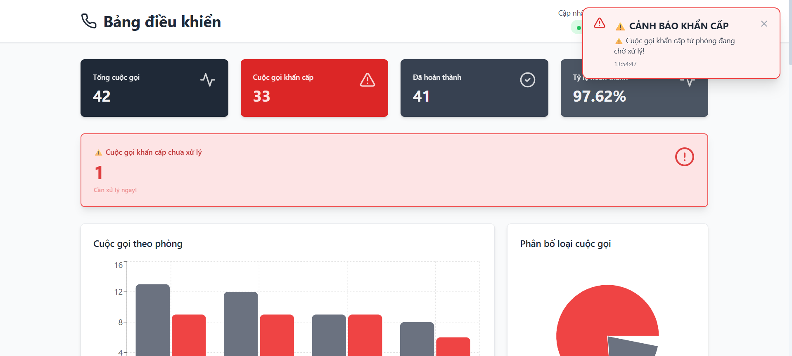
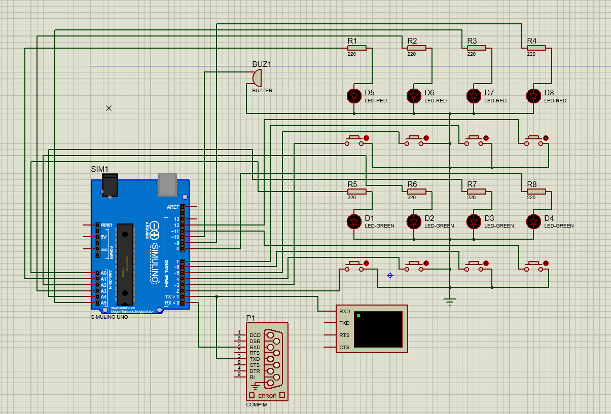

"# Smart Nurse Call System


IoT-based nurse call system với real-time monitoring dashboard, automatic alerts, nurse user management, và login/logout cho y tá. Hệ thống gồm 3 thành phần: C# WinForms GUI (y tá), Node.js Backend (API server), và React Web Dashboard (quản trị).

---

## 🚀 Tính năng Chính

- ✅ **Cuộc gọi khẩn cấp & thường** - Phân biệt mức độ ưu tiên  
- ✅ **Xếp hàng ưu tiên** - Khẩn cấp xử lý trước  
- ✅ **Real-time Monitoring** - WebSocket cập nhật tức thì  
- ✅ **Cảnh báo Audio + Vibration** - Thông báo âm thanh (3 beeps) + rung điện thoại  
- ✅ **Database Sync** - Tự động đồng bộ SQLite giữa GUI & Web  
- ✅ **Nurse Login/Logout** - Y tá đăng nhập trước khi thao tác trên GUI  
- ✅ **Nurse Management** - Admin tạo/xóa tài khoản y tá trên web  
- ✅ **Nurse Performance Stats** - Thống kê theo từng y tá và lịch sử xử lý  
- ✅ **Waiting Time Display** - Hiển thị thời gian chờ với color coding (xanh <2min, cam 2-5min, đỏ >5min)
- ✅ **Call Detail Popup** - Popup chi tiết cuộc gọi với nút xác nhận/hủy
- ✅ **Cancel Reason** - Lưu lý do hủy cuộc gọi vào database
- ✅ **Nurse Filtering in Reports** - Lọc báo cáo và thống kê theo từng y tá
- ✅ **Fallback Mode** - GUI vẫn hoạt động nếu backend down  
- ✅ **Vietnamese UI** - Giao diện tiếng Việt hoàn toàn  
- ✅ **Responsive Design** - Desktop, tablet & mobile  
- ✅ **Response Time Fix** - Thời gian phản hồi dùng local time, không còn số âm  

---

## 🧠 System Architecture

```
┌─────────────────────────────────────────────────────────────────┐
│                     SMART NURSE CALL SYSTEM                     │
└─────────────────────────────────────────────────────────────────┘

HARDWARE LAYER (Phần cứng):
  [Push Button] → [Arduino UNO]
  (P1, P2, P3, P4)   ↓ (Serial/USB)
                  [COM Port]

GUI LAYER (Giao diện Y tá):
  LoginForm.cs → Form1.cs
      ↓ (Xác thực y tá trước, sau đó xử lý call)
  C# WinForms (Form1.cs)
      ↓ (API Call / Direct DB)
  
BACKEND LAYER (Máy chủ):
  Node.js Express API
      ├→ SQLite Database (Source of Truth)
  ├→ Nurse user management & auth
      └→ WebSocket (Real-time Broadcast)
           ↓
  
ADMIN LAYER (Giao diện Quản trị):
  React Dashboard (Web Browser)
      ↓ (WebSocket Listen)
  [Display Alerts] → [Audio + Vibration]

PERMISSION MODEL:
  • Arduino ↔ GUI: WRITE (Update DB)
  • GUI ↔ Backend: READ-WRITE API (Login, confirm completion, save nurseName)
  • Backend ↔ DB: READ-WRITE (Source of truth)
  • Backend ↔ Web: READ-ONLY + admin nurse management API
  • Web ↔ Browser: READ-ONLY Display
```

---

## 🔄 System Flow (Từng bước)

### Kịch bản: Bệnh nhân gọi khẩn cấp

**Bước 1️⃣ - Bệnh nhân nhấn nút (P1 - Phòng 1 - Khẩn cấp)**
```
Patient presses button [EMERGENCY]
           ↓
Arduino receives signal
           ↓
Sends: "REQ:1:E" (Room 1, Emergency)
           ↓ (Serial → COM port)
```

**Bước 2️⃣ - C# GUI nhận dữ liệu**
```
WinForms receives: "REQ:1:E"
           ↓
Insert into database:
  RoomId: 1
  CallType: Emergency
  Status: Pending
  RequestTime: 2026-04-28 13:24:19
           ↓ (Send API Call)
```

**Bước 3️⃣ - Y tá đăng nhập và xác nhận xử lý**
```
LoginForm xuất hiện trước Form1
           ↓
Y tá đăng nhập bằng tài khoản do admin tạo
           ↓
Form1 hiển thị tên y tá đang login và nút Đăng xuất
           ↓
Khi xử lý xong call, GUI gửi nurseName lên backend
```

**Bước 4️⃣ - Backend xử lý & broadcast**
```
Backend receives: POST /api/calls/complete-with-nurse
           ↓
Update database: Status = "Completed"
Save ResponseTime = local time
Save NurseName / CompletedBy
           ↓ (WebSocket Event)
Broadcast to all Web clients:
  "emergency-alert" + "🔴 CẢNH BÁO KHẨN CẤP"
           ↓
```

**Bước 5️⃣ - Web Dashboard hiển thị**
```
React receives WebSocket event
           ↓
Trigger Audio (3 beeps) + Vibration
           ↓
Display Alert Card:
  ⚠️ CẢNH BÁO KHẨN CẤP
  📍 Phòng 1
  🔴 HỎA TỐC
           ↓
Admin sees red notification (Auto-dismiss in 8 seconds)
           ↓
```

**Bước 6️⃣ - Y tá xử lý**
```
Nurse clicks "XÁC NHẬN XỰ LÝ" button
           ↓
WinForms sends: POST /api/calls/complete-with-nurse
  { roomId: "1", callType: "Emergency", nurseName: "...", nurseId: 1 }
           ↓ (Backend updates)
Database: Status = "Completed"
NurseStats / lịch sử xử lý được cập nhật
           ↓ (Arduino receives)
```

**Bước 7️⃣ - Arduino nhận xác nhận**
```
Arduino receives: "DONE:1:E"
           ↓
Turn OFF LED P1 (Red)
           ↓
Send completion buzzer (1 beep)
           ↓
System ready for next call
```

---

## 📸 Demo & Screenshots

### 1️⃣ C# WinForms GUI - Giao diện Y tá

Y tá kết nối Arduino qua COM port, nhận và xử lý cuộc gọi:



**Tính năng:**
- Bảng hàng đợi hiển thị cuộc gọi chờ xử lý
- Phân biệt khẩn cấp (hồng) vs thường (xanh)
- Nút "XÁC NHẬN XỰ LÝ" để hoàn thành
- Nhật ký hệ thống chi tiết

---

### 2️⃣ React Web Dashboard - Giao diện Quản trị

Quản trị viên giám sát real-time từ web:



**Tính năng:**
- 📊 Thống kê tổng hợp (tổng, khẩn cấp, hoàn thành, tỷ lệ)
- 🔴 Cảnh báo khẩn cấp nổi bật với âm thanh
- 📋 Danh sách cuộc gọi chưa xử lý
- 📈 Biểu đồ phân tích theo phòng
- ⏱️ Cập nhật real-time mỗi 4 giây

---

### 3️⃣ Proteus 8 Circuit Design - Sơ đồ mạch điện

Thiết kế phần cứng cho hệ thống:



**Thành phần:**
- Arduino Uno (CPU)
- 4 Push buttons (P1, P2, P3, P4)
- 8 LED chỉ báo (4 xanh + 4 đỏ)
- Buzzer (cảnh báo âm thanh)
- Module RS232 (COM port)

---

## 📋 Yêu cầu

- **Backend**: Node.js 14+, npm/yarn
- **Frontend**: Node.js 14+, npm/yarn
- **Database**: SQLite3 (tự động tạo)
- **Port**: 3000 (Frontend), 5000 (Backend) - có thể thay đổi

## 🚀 Cài đặt & Chạy

### 1. Chuẩn bị Database

Trước tiên, cập nhật đường dẫn database trong file `backend/.env`:

```bash
DATABASE_PATH="/path/to/your/nurse_call.db"
```

Ví dụ:
- Windows: `C:/Users/YourUsername/Documents/nurse_call.db`
- macOS/Linux: `/home/username/nurse_call.db`

Database sẽ được tạo tự động khi backend chạy lần đầu.

### 2. Chạy Backend Server

```bash
cd backend
npm install
cp .env.example .env    # Nếu có file .env.example
# Cập nhật DATABASE_PATH trong .env theo đường dẫn của bạn
npm start
```

Backend chạy tại: **http://localhost:5000**

Output sẽ hiển thị:
```
Server running on http://localhost:5000
Database: /path/to/your/nurse_call.db
WebSocket enabled for real-time updates
```

### 3. Chạy Frontend Dashboard (mở terminal khác)

```bash
cd frontend
npm install
npm run dev
```

Frontend chạy tại: **http://localhost:3000**

Mở browser và đăng nhập:
- **Tên**: admin
- **Mật khẩu**: admin123

Nếu cần tạo sẵn tài khoản demo, gọi:
```bash
curl -X POST http://localhost:5000/api/init
```

Tài khoản demo được tạo sẵn:
- **Admin**: admin / admin123
- **Nurse**: nurse1 / nurse123

### 4. Kết nối C# GUI (tùy chọn)

Nếu có C# WinForms app:
- Đảm bảo Backend đang chạy (`http://localhost:5000`)
- Database path trong C# project phải trỏ đến cùng file SQLite
- Cổng COM phải đúng với Arduino device
- Khi mở app, LoginForm sẽ hiện trước Form1

## ⚙️ Cấu hình

### File `.env` (Backend)

```bash
# Port chạy server
PORT=5000

# Đường dẫn tuyệt đối đến database SQLite
# Windows:
DATABASE_PATH="C:/Users/YourUsername/Documents/nurse_call.db"
# macOS/Linux:
DATABASE_PATH="/home/username/Documents/nurse_call.db"

# Môi trường
NODE_ENV=development

# JWT Secret (THAY ĐỔI TRƯỚC KHI DEPLOY!)
JWT_SECRET=your-secret-key-change-in-production-12345
```

### Thay đổi cổng

**Backend** - sửa `backend/.env`:
```bash
PORT=5001
```

**Frontend** - sửa `frontend/vite.config.js`:
```javascript
export default {
  server: {
    port: 3001
  }
}
```

### Thay đổi Admin Password

Sửa `backend/index.js` (dòng chứa `const ADMIN_PASSWORD`):
```javascript
const ADMIN_PASSWORD = 'your-new-password';
```

⚠️ **Lưu ý**: Chỉ dùng cho demo! Production nên dùng database user table + bcrypt.

### JWT Secret Key (PRODUCTION)

Thay đổi `backend/.env` trước khi deploy:
```bash
JWT_SECRET=generate-strong-random-key-here
```

## 🎯 Tính năng

✅ **Authentication**: JWT-based login system  
✅ **Real-time Monitoring**: WebSocket cho live updates  
✅ **Audio Alerts**: 3 beeps (khẩn cấp), 1 beep (hoàn thành)  
✅ **Vibration Support**: Haptic feedback on mobile devices  
✅ **Vietnamese UI**: Full Vietnamese localization  
✅ **Responsive Design**: Desktop, tablet & mobile  
✅ **API Integration**: REST endpoints cho C# GUI  
✅ **Fallback Mode**: GUI hoạt động nếu backend down  

## � Screenshots

### 1. C# WinForms GUI - Giao diện Y tá
Giao diện cho y tá xác nhận xử lý cuộc gọi từ bệnh nhân:
- LoginForm bắt buộc trước khi vào Form1
- Kết nối COM port với Arduino
- Bảng hàng đợi hiển thị cuộc gọi chờ xử lý
- Phân biệt cuộc gọi khẩn cấp (hồng) và thường (xanh)
- Nút "XÁC NHẬN XỰ LÝ" để hoàn thành
- Nhật ký hệ thống theo dõi tất cả thao tác
- Hiển thị tên y tá đang đăng nhập và nút Đăng xuất


### 2. React Web Dashboard - Giao diện Quản trị
Bảng điều khiển web cho quản trị viên giám sát real-time:
- Thống kê tổng hợp: tổng cuộc gọi, khẩn cấp, đã hoàn thành, tỷ lệ %
- Cảnh báo khẩn cấp nổi bật (màu đỏ) với thông báo âm thanh
- Danh sách cuộc gọi chưa xử lý
- Biểu đồ phân tích theo phòng và loại cuộc gọi
- Tab quản lý y tá: tạo/xóa user nurse
- Tab thống kê y tá: xem hiệu suất và lịch sử xử lý
- Giao diện tối ưu: xám/trắng với đỏ cho cảnh báo


### 3. Proteus 8 Circuit Design - Sơ đồ mạch điện
Thiết kế mạch điện cho hệ thống phần cứng:
- Arduino Uno làm bộ xử lý trung tâm
- 4 nút bấm cho 4 phòng bệnh (P1, P2, P3, P4)
- 8 LED chỉ báo trạng thái (4 xanh + 4 đỏ)
- Buzzer để phát cảnh báo âm thanh
- Module RS232 để kết nối với máy tính (COM port)
- Thiết kế xử lý đơn giản, tin cậy


## �📡 API Endpoints

### Authentication
```
POST /api/auth/login
Content-Type: application/json
Body: { "username": "admin", "password": "admin123" }
Response: { "success": true, "token": "jwt_token_here" }
```

### Nurse Management
```
GET /api/users
POST /api/users
DELETE /api/users/:id
GET /api/nurses/stats/all
GET /api/nurses/:nurseId/logs
POST /api/calls/complete-with-nurse
POST /api/init
```

### Logs (cần JWT token)
```
GET /api/logs
GET /api/logs/stats
GET /api/logs/by-room
Header: Authorization: Bearer {token}
```

### GUI Call Completion
```
POST /api/calls/complete
Body: { "roomId": "101", "callType": "Emergency" }
Response: { "success": true, "message": "Call completed" }
```

### GUI Call Completion with Nurse
```
POST /api/calls/complete-with-nurse
Body: { "roomId": "101", "callType": "Emergency", "nurseName": "Nguyễn Văn A", "nurseId": 1 }
Response: { "success": true, "message": "Call from room 101 marked as completed by Nguyễn Văn A" }
```

## 🔄 Kiến trúc Hệ thống

```
Device/Arduino
     ↓
C# GUI (LoginForm.cs → Form1.cs) - Đăng nhập y tá, xác nhận xử lý
     ↓
Backend API (Node.js/Express)
  ├→ WebSocket broadcast
  └→ SQLite Database + nurse management
     ↑
React Dashboard - Nhận cảnh báo real-time
```

**Permission Model:**
- **C# GUI**: WRITE access (gọi API để cập nhật)
- **Backend**: READ-WRITE (database source of truth)
- **Web Dashboard**: READ-ONLY + admin nurse management

## 🧪 Testing

### Test Backend API

```bash
# Health check
curl http://localhost:5000/api/health

# Login
curl -X POST http://localhost:5000/api/auth/login \
  -H "Content-Type: application/json" \
  -d '{"username":"admin","password":"admin123"}'

# Tạo dữ liệu demo
curl -X POST http://localhost:5000/api/init

# Get logs (thay TOKEN bằng jwt token từ login)
curl -H "Authorization: Bearer TOKEN" \
  http://localhost:5000/api/logs
```

### Test WebSocket

```javascript
// Mở browser console (F12)
const socket = io('http://localhost:5000');
socket.on('call-completed', (data) => console.log('Call completed:', data));
socket.on('data-update', (data) => console.log('Data updated:', data));
```

## 📁 Project Structure

```
web-nursecall/
├── assets/
│   ├── gui.png               # C# WinForms GUI screenshot
│   ├── web.png               # React dashboard screenshot
│   └── proteus.png           # Proteus circuit diagram screenshot
├── backend/
│   ├── index.js              # Main API server
│   ├── package.json          # Dependencies
│   ├── .env                  # Config (DATABASE_PATH, JWT_SECRET, PORT)
│   └── .gitignore
├── frontend/
│   ├── src/
│   │   ├── App.jsx           # Auth & routing
│   │   ├── components/       # Dashboard, Login, Cards, Charts, etc.
│   │   ├── services/api.js   # API client với JWT interceptor
│   │   └── utils/            # Audio & vibration utilities
│   ├── index.html
│   ├── package.json
│   ├── vite.config.js        # Build config
│   ├── tailwind.config.js    # Tailwind CSS config
│   └── .gitignore
├── C#/
│   └── NurseCall/
│       ├── NurseCall.sln         # Visual Studio solution
│       ├── LoginForm.cs          # Nurse login screen
│       ├── Form1.cs              # Main Y tá interface
│       ├── Form1.Designer.cs     # UI designer file
│       ├── DatabaseHelper.cs     # SQLite operations
│       ├── SerialPortManager.cs  # Arduino COM communication
│       ├── bin/Debug/
│       │   └── nurse_call.db     # Shared SQLite database
│       └── ... (other C# project files)
├── sketch_apr28a/
│   ├── sketch_apr28a.ino         # Arduino firmware code
│   │   └── Multi-room call logic
│   │   └── Serial communication (REQ/DONE protocol)
│   │   └── Emergency vs Normal call support
│   └── build/
│       └── arduino.avr.uno/      # Compiled Arduino binaries
│           ├── sketch_apr28a.ino.hex
│           ├── sketch_apr28a.ino.elf
│           └── ... (other build artifacts)
├── NurseSystem.zip              # Full C# project archive
├── README.md                    # This file
└── ... (config files)

**Key Files by Role:**
- Y tá (Nursing Staff): C#/NurseCall/LoginForm.cs, C#/NurseCall/Form1.cs
- Backend (API): backend/index.js
- Admin (Web): frontend/src/components/Dashboard.jsx
- Arduino (Hardware): sketch_apr28a/sketch_apr28a.ino
- Shared Database: C#/NurseCall/bin/Debug/nurse_call.db
- Screenshots: assets/*.png
```

**Component Architecture:**
1. **Backend** (`backend/`): Node.js Express API server
   - Manages SQLite database
   - Broadcasts WebSocket events
   - Provides REST endpoints for GUI & Web

2. **Frontend** (`frontend/`): React web dashboard
   - Admin interface with real-time monitoring
   - Authentication with JWT
   - Audio alerts & notifications

3. **C# GUI** (`C#/NurseCall/`): WinForms application for nursing staff
   - Connects to Arduino via COM port
   - Confirms task completion
   - Calls backend API
   - Falls back to local database if offline

4. **Arduino** (`sketch_apr28a/`): Microcontroller firmware
   - Receives push button inputs from 4 rooms
   - Sends call requests via serial port
   - Receives completion confirmation
   - Controls LED indicators & buzzer

5. **Database** (`C#/NurseCall/bin/Debug/nurse_call.db`): SQLite
   - Shared between C# GUI and backend
   - Source of truth for all call data
   - Real-time sync via WebSocket
  - User management tables: Users, NurseStats

## 🐛 Gỡ lỗi

### Backend không kết nối database
**Lỗi**: `Error opening database: ...`

**Giải pháp**:
1. Kiểm tra `backend/.env` có `DATABASE_PATH` đúng
2. Đảm bảo đường dẫn tồn tại hoặc folder tồn tại
3. Kiểm tra quyền đọc/ghi folder
4. Nếu C# app đang dùng DB, đảm bảo backend mở READ-ONLY

### Thống kê y tá hiển thị 0
**Lỗi**: Tổng yêu cầu, đã xử lý, tỷ lệ và thời gian TB đều bằng 0

**Giải pháp**:
1. Restart backend để load logic aggregate từ Logs
2. Kiểm tra y tá đã xử lý call bằng endpoint `/api/calls/complete-with-nurse`
3. Đảm bảo `Logs.NurseName` hoặc `CompletedBy` có dữ liệu
4. Gọi `GET /api/nurses/stats/all` để xem số liệu mới

### Thời gian phản hồi âm
**Lỗi**: `-419 phút` hoặc `-25198s`

**Giải pháp**:
1. Backend đã chuyển sang ghi ResponseTime theo local time
2. Dữ liệu cũ vẫn có thể âm, nhưng khi hiển thị sẽ được chặn về 0
3. Xóa dữ liệu test cũ nếu muốn số liệu sạch hoàn toàn

### Frontend không kết nối backend
**Lỗi**: `Network Error` hoặc `Failed to connect`

**Giải pháp**:
1. Kiểm tra backend đang chạy: `curl http://localhost:5000/api/health`
2. Nếu backend ở port khác, cập nhật `frontend/src/services/api.js`
3. CORS đã được enable ở backend

### Cổng đang sử dụng
**Lỗi**: `Port 3000 (hoặc 5000) already in use`

**Giải pháp**:
1. Sửa `PORT` trong `backend/.env` (ví dụ: `PORT=5001`)
2. Sửa `port` trong `frontend/vite.config.js` (ví dụ: `port: 3001`)
3. Hoặc tìm process dùng port: `lsof -i :5000` (macOS/Linux) hoặc `netstat -ano | findstr :5000` (Windows)

### Không nghe được audio alert
**Lỗi**: Cảnh báo hiển thị nhưng không có tiếng

**Giải pháp**:
1. Kiểm tra volume browser & máy
2. Browser cần user interaction trước (click/enter trang)
3. Một số browser yêu cầu HTTPS cho audio/vibration

## 🌐 Deployment

### Build Frontend
```bash
cd frontend
npm run build
# Output: dist/ folder - sẵn sàng deploy
```

### Production Backend
1. Dùng process manager như PM2
2. Set `NODE_ENV=production` trong `.env`
3. Dùng reverse proxy (nginx/Apache)
4. **QUAN TRỌNG**: Đổi `JWT_SECRET` thành key mạnh

## 📝 Ghi chú quan trọng

- **Demo Mode**: Admin password cứng (không production)
- **Database Locking**: Backend mở READ-ONLY để tránh conflict
- **Vibration API**: Chỉ hoạt động trên mobile hỗ trợ
- **WebSocket**: Auto reconnect khi mất kết nối
- **Real-time Updates**: Dashboard tự động refresh mỗi 4 giây

## 📧 Support

Nếu gặp vấn đề:
1. Kiểm tra backend logs: mở terminal backend, xem console output
2. Kiểm tra frontend logs: F12 → Console tab
3. Xem Network tab (F12) để debug API calls
4. Đảm bảo `DATABASE_PATH` đúng trong `.env`
5. Restart backend & frontend

---

**Version**: 1.0.0  
**Last Updated**: April 2026" 
